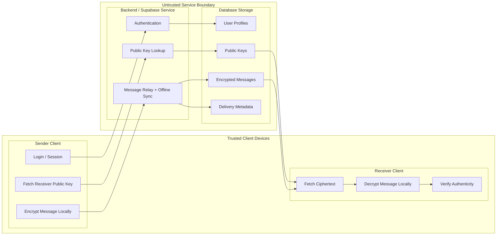

# Whispr — System Architecture

## High-Level Components

### 1. Client Application
Responsible for:
- user login
- keypair generation
- encryption and decryption
- displaying messages
- verifying message authenticity

### 2. Backend Server
Responsible for:
- authentication
- storing user public keys
- routing encrypted messages
- storing ciphertext
- syncing offline messages

### 3. Database
Stores:
- user profiles
- public keys
- encrypted messages
- delivery status
- device metadata

## System Diagram

## Trust Model
The backend is **untrusted for message confidentiality**.

This means:
- server can process requests
- server can relay encrypted data
- server cannot decrypt user messages

## Data Flow
1. Sender logs in
2. Sender fetches receiver public key
3. Sender encrypts message locally
4. Ciphertext is sent to backend
5. Backend stores and relays ciphertext
6. Receiver fetches ciphertext
7. Receiver decrypts message locally

## Architecture Style
- Frontend: Next.js / React / TypeScript
- Auth + Data Platform: Supabase Auth + Postgres
- Realtime Layer: Supabase Realtime
- Database direction: PostgreSQL
- Crypto Layer: Web Crypto API with modern elliptic-curve and AEAD primitives

## Implementation Note

This document describes the target system architecture. The current repository is still moving toward this design and does not yet implement every component listed here.
