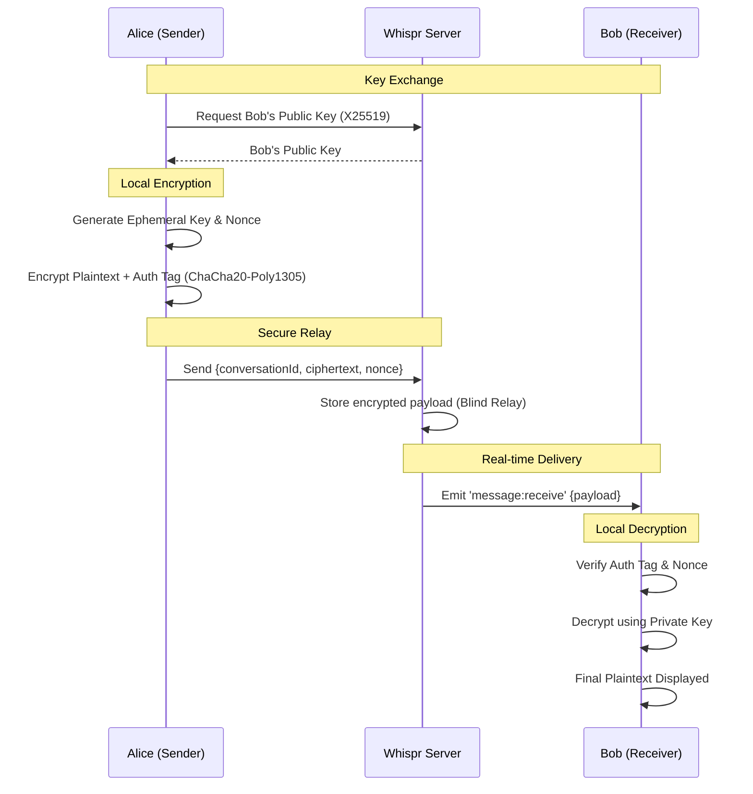

# 🔐 Whispr — Cryptography & Security Flow

Whispr is built on the principle that the backend is a **hostile environment**. Message confidentiality and integrity are guaranteed mathematically between clients, rather than via server-side policy.

---

## 🏗️ The E2EE Flow

The following diagram illustrates how a message moves from Sender A to Receiver B without the server being able to read it.

---

## 🛠️ Cryptographic Primitives

We choose modern, performance-oriented primitives that are widely supported via the **Web Crypto API** or lightweight libraries like **libsodium**.

### 1. Key Exchange (X25519)
Used to establish a shared secret or distribute public keys for asynchronous messaging. It provides high security with small key sizes.

### 2. Authenticated Encryption (ChaCha20-Poly1305)
We prefer ChaCha20-Poly1305 over AES-GCM for mobile and web environments because it is faster in software implementations and provides robust **Authenticated Encryption with Associated Data (AEAD)**.

### 3. Key Derivation (HKDF-SHA256)
All symmetric keys used for actual encryption are derived using HKDF to ensure high entropy and isolation between different security contexts.

### 4. Integrity (Ed25519)
Optional digital signatures to ensure that messages originated from the claimed sender and haven't been replayed or modified.

---

## 🛡️ Trust Assumptions
- **The Server is Trusted for:** Availability, routing, and metadata management.
- **The Server is NOT Trusted for:** Privacy, content integrity, or identity verification (unless using PGP-style out-of-band verification).

---

> [!IMPORTANT]
> This flow ensures **Forward Secrecy** if ephemeral keys are rotated regularly. Implementations should focus on minimizing the lifetime of keys stored in memory.
