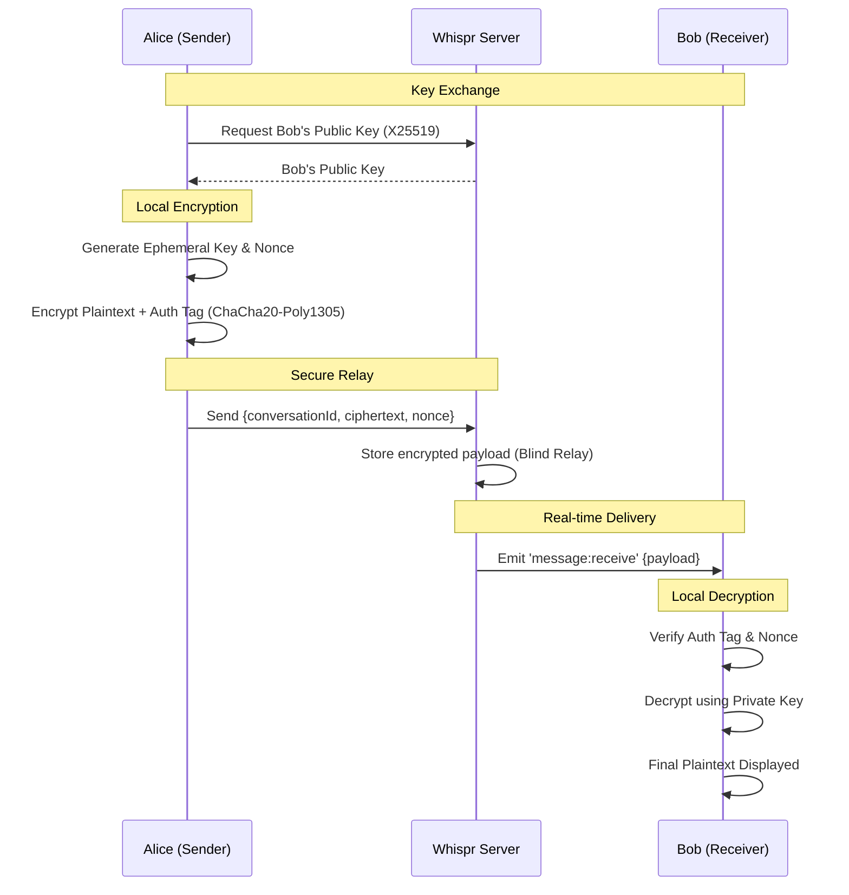

# 🔐 Whispr — Cryptography & Security Flow

Whispr is built on the principle that the backend is a **hostile environment**. Message confidentiality and integrity are guaranteed mathematically between clients, rather than via server-side policy.

---

## 🏗️ The E2EE Flow

The following diagram illustrates how a message moves from Sender A to Receiver B without the server being able to read it.

---

## 🛠️ Cryptographic Primitives

We choose modern, performance-oriented primitives that are appropriate for web clients and can be implemented through the **Web Crypto API** and carefully selected supporting libraries where necessary.

### 1. Key Exchange (X25519)
Used to establish a shared secret or distribute public keys for asynchronous messaging. It provides high security with small key sizes.

### 2. Authenticated Encryption (AEAD)
Whispr should use a modern AEAD construction for message confidentiality and integrity. The exact implementation choice must match the actual client platform capabilities and should be documented when finalized.

### 3. Key Derivation (HKDF-SHA256)
All symmetric keys used for actual encryption are derived using HKDF to ensure high entropy and isolation between different security contexts.

### 4. Integrity and Authenticity
Digital signatures or equivalent authenticated message designs may be used to ensure that messages originated from the claimed sender and have not been modified or replayed.

---

## 🛡️ Trust Assumptions
- **The Server is Trusted for:** Availability, routing, and metadata management.
- **The Server is NOT Trusted for:** Privacy, content integrity, or identity verification (unless using PGP-style out-of-band verification).

---

## 🔑 Private Key Lifecycle

Whispr intentionally separates login from message decryption:
- JWT login proves account access.
- The private keyring proves message access.
- Logout clears the JWT session but does not delete local private keys.
- Key regeneration adds a new keypair to the keyring so older messages can still decrypt with older private keys.
- Public key upload activates the new public key for future inbound messages.

Encrypted backup flow:
1. The client serializes the local keyring.
2. The client derives a backup key from the user's secret using PBKDF2-SHA256.
3. The client encrypts the serialized keyring with AES-GCM.
4. The server stores only ciphertext backup material: `ciphertext`, `salt`, `iv`, and `version`.
5. A fresh device can restore old-chat access only if it can decrypt that backup.

If a private key for a historical message is missing, the client should show a missing-key state. That is different from integrity failure, which means ciphertext/authenticated metadata verification failed.

---

> [!IMPORTANT]
> This document describes the intended security direction. The exact message format, key rotation policy, replay protection strategy, and signature model should be documented alongside implementation once they are finalized.
