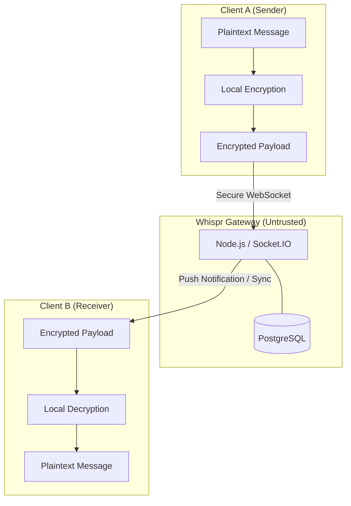

# Whispr

**Secure, end-to-end encrypted communication for a zero-trust backend model.**

[](https://opensource.org/licenses/MIT)
[](https://github.com/utksh1/Whispr)

Whispr is an end-to-end encrypted (E2EE) messaging platform designed on the principle of **Zero Trust**. The backend serves only as a blind relay, ensuring that even if the server is fully compromised, user conversations remain private and unreadable.

---

## What Whispr Is

Whispr is an end-to-end encrypted messaging project designed around a simple assumption: the backend may fail, leak, or be compromised, and user privacy should still hold.

The repository currently contains:

- a `client/` Next.js application
- a `server/` Express and Socket.IO service
- a `Docs/` directory describing the target architecture, security model, and roadmap

Service-specific setup:

- [`client/README.md`](./client/README.md)
- [`server/README.md`](./server/README.md)

Some documentation describes the intended system design beyond what is already implemented in code. That distinction is deliberate and important for contributors.

## System Architecture

Whispr uses a decoupled architecture where all cryptographic operations are offloaded to the client.



---

## Design Goals

- Client-side encryption and decryption
- Ciphertext-only message storage on the backend
- Secure public key distribution for one-to-one messaging
- Realtime encrypted message delivery
- A design that remains meaningful under backend compromise

---

## Current Stack

| Layer | Technology |
| :--- | :--- |
| **Frontend** | Next.js, React, TypeScript, Tailwind CSS |
| **Backend** | Node.js, Express, Socket.IO, Zod |
| **Database** | Planned: PostgreSQL |
| **Security Direction** | Web Crypto API, libsodium-compatible design, X25519, HKDF, AEAD |

## Local Development

### Client

```bash
cd client
npm install
npm run dev
```

### Server

```bash
cd server
npm install
node index.js
```

Server health check:

```bash
curl http://localhost:4000/health
```

---

## Documentation

The [`Docs/`](./Docs) folder contains the project design set:

Start with [`Docs/README.md`](./Docs/README.md) for the document map and documentation rules.

- [**Project Overview**](./Docs/01_Project_Overview.md)
- [**Problem Statement**](./Docs/02_Problem_Statement.md)
- [**Core Features**](./Docs/03_Core_Features.md)
- [**System Architecture**](./Docs/04_System_Architecture.md)
- [**Cryptography and Security Flow**](./Docs/05_Cryptography_Security_Flow.md)
- [**Threat Model**](./Docs/06_Threat_Model.md)
- [**Tech Stack**](./Docs/07_Tech_Stack.md)
- [**Database Design**](./Docs/08_Database_Design.md)
- [**API Design**](./Docs/09_API_Design.md)
- [**Development Roadmap**](./Docs/10_Development_Roadmap.md)
- [**Demo Flow**](./Docs/11_Demo_Flow.md)
- [**Pitch Notes**](./Docs/12_Pitch_Notes.md)

## Contributing

Contributor guidance lives in [`CONTRIBUTING.md`](./CONTRIBUTING.md).

Use it for:

- local setup
- development expectations
- validation steps
- pull request standards
- documentation update rules

---

## Vision

Most messaging systems rely on backend trust. Whispr is built on a different assumption: **the backend may fail, leak, or be compromised.** User privacy should still hold.

---

## License

Distributed under the MIT License. See `LICENSE` for more information.
