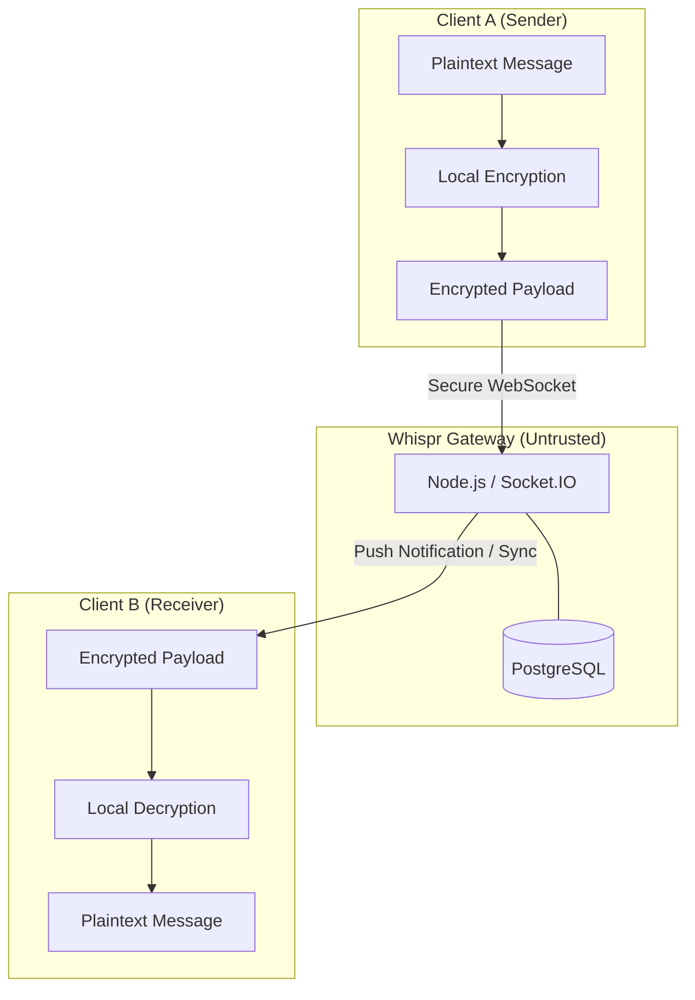

# 🤫 Whispr

**Secure, End-to-End Encrypted Communication for the Modern Web.**

Whispr is an end-to-end encrypted (E2EE) messaging platform designed on the principle of **Zero Trust**. The backend serves only as a blind relay, ensuring that even if the server is fully compromised, user conversations remain private and unreadable.

---

## 🏗️ System Architecture

Whispr uses a decoupled architecture where all cryptographic operations are offloaded to the client.

---

## ✨ Key Features

- 🔒 **True E2EE**: Messages are encrypted on the sender's device and decrypted only on the receiver's.
- 🚫 **Zero-Knowledge Backend**: The server never sees plaintext, keys, or metadata that could reveal conversation content.
- 🔑 **Secure Key Exchange**: Built-in mechanisms for public key distribution and verification.
- ⚡ **Real-time Sync**: Low-latency message delivery via WebSockets.
- 🛡️ **Compromise Resilience**: Designed to protect past and future messages even if the database is leaked.

---

## 🛠️ Tech Stack

| Layer | Technology |
| :--- | :--- |
| **Frontend** | React / Next.js, Tailwind CSS |
| **Backend** | Node.js, Express, Socket.IO |
| **Database** | PostgreSQL + Prisma ORM |
| **Security** | Web Crypto API, libsodium, X25519 |

---

## 📖 Detailed Documentation

Explore deep dives into our design and security model in the [`Docs/`](./Docs) folder:

- [**Project Overview**](./Docs/01_Project_Overview.md) — Vision and value prop.
- [**System Architecture**](./Docs/04_System_Architecture.md) — Component breakdown.
- [**Crypto Flow**](./Docs/05_Cryptography_Security_Flow.md) — Deep dive into the math.
- [**Tech Stack**](./Docs/07_Tech_Stack.md) — Implementation details.
- [**API Design**](./Docs/09_API_Design.md) — Endpoint specifications.

---

## 🚀 Vision

Most messaging systems rely on backend trust. Whispr is built on a different assumption: **the backend may fail, leak, or be compromised.** User privacy should still hold.

---

## ⚖️ License

Distributed under the MIT License. See `LICENSE` for more information.
